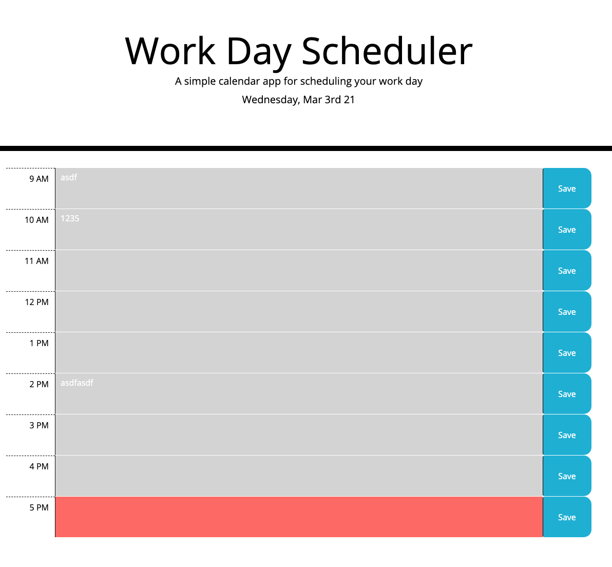

# Columbia University Bootcamp Week 5 Homework: Calendar Planner

## Introduction
This repo is my fifth homework for my Columbia Bootcamp. I completed the following:
1. I completed a starter code to complete a work day calendar planner.
2. I used bootstrap table to create the planner with 1 hour blocks.
3. I stored all the plan entered by the user in local storage. 
4. I changed the background color of the time blocks with jquery and real time checks using momentjs. The change of color is being changed on real time using a timer in the background. 

Screenshot:

## Technology
* HTML
* CSS
* JS
* Jquery
* Bootstrap
* MomentJS

## Link to Deployed Site
https://byung90.github.io/columbia-week5-homework/

## License
[MIT](https://choosealicense.com/licenses/mit/)